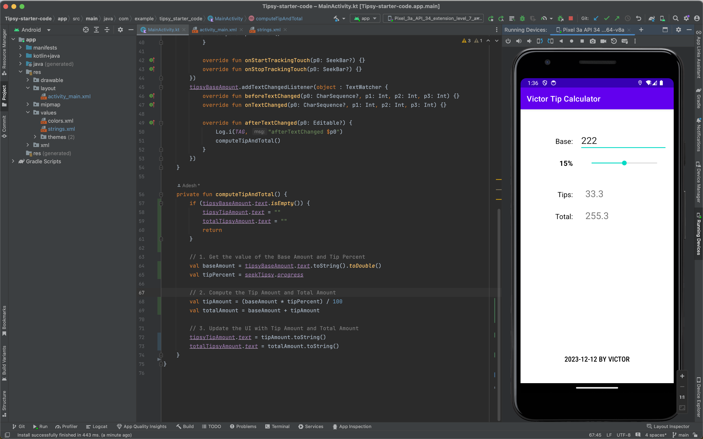
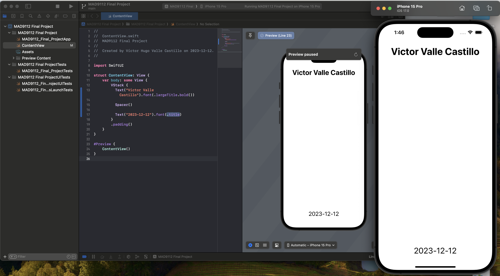
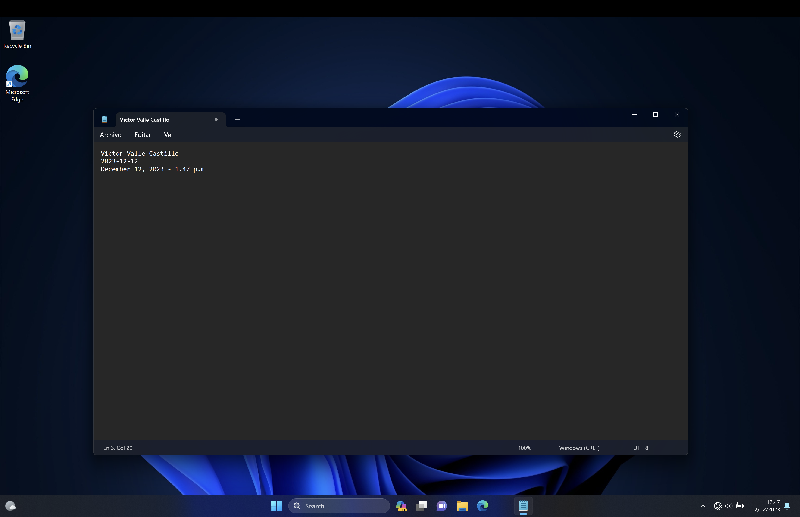

# Victor Valle Castillo Final Project

Step 1: code

```javascript
const getDaysUntilChristmas = () => {
  const today = new Date();

  const options = {
    weekday: 'long',
    year: 'numeric',
    month: 'long',
    day: 'numeric',
    timeZone: 'UTC',
  };
  const christmas = new Date('2023-12-24').toLocaleDateString('en-CA', options);

  const todayDate = today.getDate();
  const christmasDate = new Date(christmas).getDate();
  const remainingDays = christmasDate - todayDate;

  const response = `${remainingDays} days left before Christmas.`;
  return response;
};

const remainingDaysForChristmas = getDaysUntilChristmas();
console.log(remainingDaysForChristmas);

// Array of numbers
const gladiators = [1, 2, 3, 4, 5, 6, 7, 8, 9];
let sum = 0;
for (let i = 0; i < gladiators.length; i += 1) {
  const gladiator = gladiators[i];
  sum += gladiator;
}
const average = sum / gladiators.length;
console.log(average);
```

Steps 2, 3, 4: image




